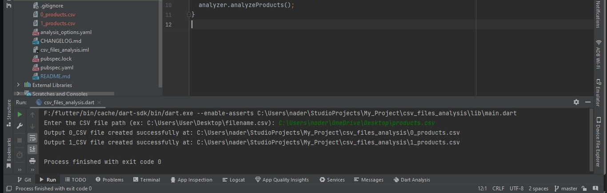
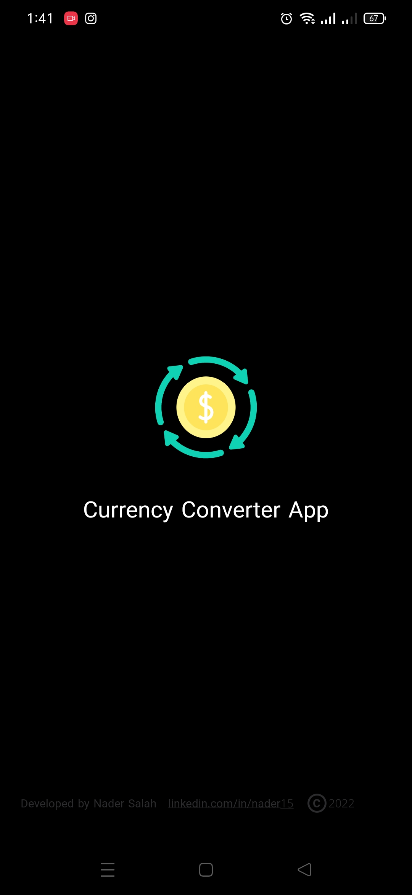
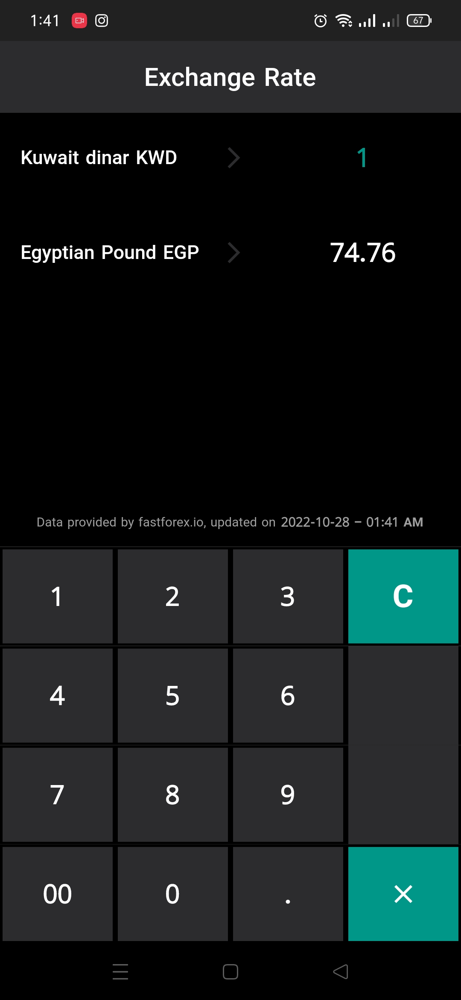
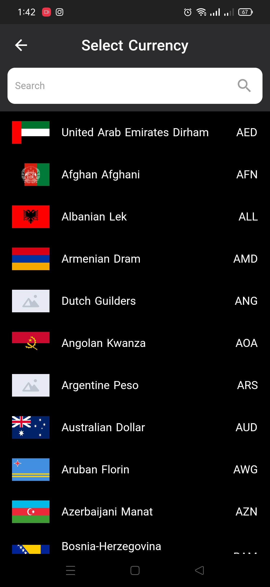
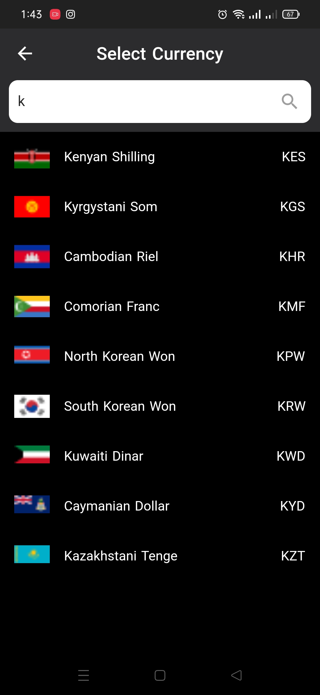

# Currencies Converter

Currencies Converter is an app used for converting currencies values to several country's currencies with a real time data from api

## Design pattern & App architecture

- State management : GetX (Separate the UI and business logic & Code easier to test & Code more readable)
- Clean Code

## ScreenShots

<table>
    <tr>
        <td></td>
    </tr>
</table>

<table>
    <tr>
        <td></td>
        <td></td>
    </tr>
    <tr>
        <td></td>
        <td></td>
    </tr>
</table>

## Android Application

Install Application From Google drive [Install](https://drive.google.com/file/d/1YwoeDQj7dYnig7R5fNAcPR6H_oEusUnR/view?usp=sharing)
